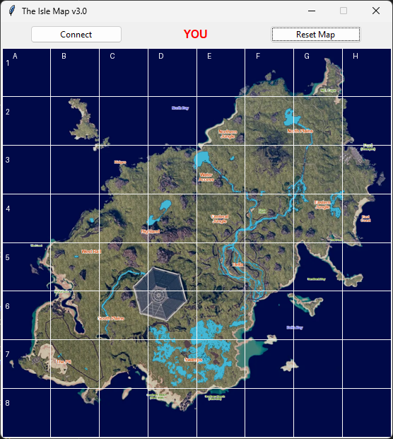

# The Isle Map

**The Isle Map** is a real-time map tracking application for players in a shared world. It allows both offline and online tracking of player positions, drawing trails on a map, and synchronizing player movements across multiple clients using a Socket.IO server.

---

### The Isle Map UI

---

## Features

- **Real-Time Online Tracking**: Synchronizes player positions across all connected clients in real time.
- **Offline Position Logging**: Automatically tracks your coordinates from the clipboard when offline.
- **Color-Coded Players**: Each player is assigned a unique color for easy identification.
- **Trail Visualization**: Draws connecting trails between player positions for movement history.
- **Clipboard Monitoring**: Reads coordinate data directly from your clipboard to update positions.
- **Interactive GUI**: Connect to server, reset map, and view player positions via a clean Tkinter interface.
- **Customizable Map and World Bounds**: Supports scaling, bounding box mapping, and grid overlays.
- **Grid Overlay**: Optional chessboard-style grid with labeled columns and rows.
- **Safe Color Management**: Prevents duplicate colors for connected players and allows color release upon disconnect.